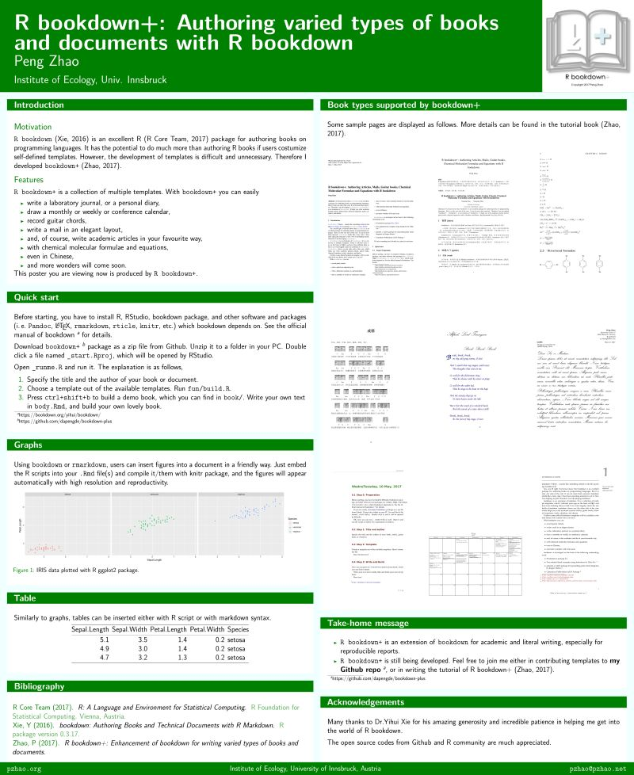
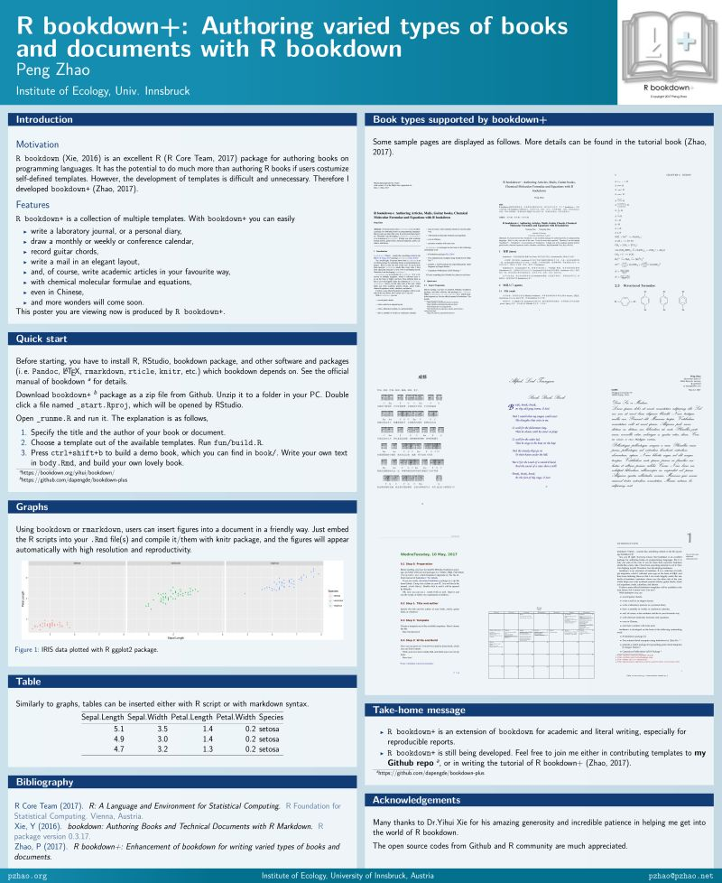
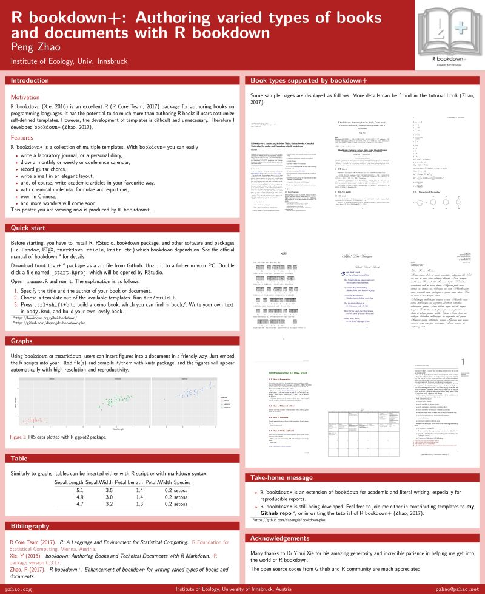

# Prelogue {-}

# (PART) Basic{-}
# Introduction

## What is `bookdown`

This book is talking about `bookdownplus`, but let's start with `bookdown` [@R-bookdown].

`bookdown` is a software for writing books or documents. It is something like Microsoft Word, but more elegant, more powerful, and easier. If you know LaTeX, it would be much helpful to get involved in `bookdown`.  If not, don't worry, that is the reason why I wrote this book. With `bookdown`, users can

- easily insert table of contents, figures and tables with cross-reference, footnotes, and index; 

- easily embed equations, citations, R scripts;

- obtain multiple formats of outputs such as pdf, word and html files;

- have the best experience of writing reproducible documents.

If my description is insufficient for you to know what is `bookdown`, you could have a brief look at the official website of `bookdown`^[http://bookdown.org], where some of numerous books written with `bookdown` are listed. Three of them on the home page are authored by me \m{21 June 2017}.

## What is `bookdownplus`

Thus, `bookdownplus` sounds like something related to `bookdown` ? 

Yes, you **_R_** right. Many people know that `bookdown` is an excellent package for authoring books on programming languages. Few people know that it can do more than expected. `bookdown` looks like a fantastic cake. People are wondering how it tastes, but people don't know how to cut it and grab a piece onto his own plate.

```{r imgcake, fig.cap='A cake. How should I cut it in a right way?', out.width='50%', fig.align='center', echo=FALSE}
knitr::include_graphics("images/cake.jpg")
```

I expected someone to cut it. Now I cannot wait and am helping myself. Therefore I have developed `bookdownplus`.

\m{The former project was called bookdown-plus, providing a folder for users to download and modify. It was later abandoned because it was not so convenient as an R package.}

`bookdownplus` is an extension of `bookdown`. It is a collection of multiple templates, which I collected years ago on the basis of LaTeX, and have been tailoring them so that I can work happily under the umbrella of `bookdown`. `bookdownplus` helps you write varied types of books and documents.  This book you are reading at the moment was exactly produced by `bookdownplus`.

I believe some official `bookdown` templates will be available in the near future, but I cannot wait. Can you? The cake will not be fresh any more.

`bookdownplus` is a knife for cutting the `bookdown` cake. Feel free to join me in sharpening it if you would like!

## Why `bookdownplus`

With `bookdownplus` you can easly get into the wonderful world of `bookdown`. You can

- write guitar chords,

- write a mail in an elegant layout,

- write a laboratory journal, or a personal diary,

- draw a monthly or weekly or conference calendar, \m{although still in LaTeX format.}

- and, of course, write academic articles in your favourite way,

- with chemical molecular formulae and equations,

- even in Chinese, \m{Perhaps in some other languages as well. I have not tried yet.}

- and more wonders will come soon.

## Giants' Shoulders

`bookdownplus` is developed on the basis of the following outstanding work:

- R `bookdown` package [@R-bookdown], of course;

- two minimal book examples by Yihui Xie ^[https://github.com/yihui/bookdown-minimal] ^[https://github.com/rstudio/bookdown-demo];

- gchords, a LaTeX package for typesetting guitar chord diagrams by Kasper Peeters ^[http://kasper.phi-sci.com/gchords/],

- Copernicus Publications LaTeX Package ^[http://publications.copernicus.org/for_authors/latex_instructions.html], 

- MDPI LaTeX template ^[http://www.mdpi.com/]

- mhchem package by Martin Hensel ^[https://www.ctan.org/pkg/mhchem]

- kuleuven-templates ^[https://github.com/exporl/kuleuven-templates], 

- classicthesis package by Andre Miede ^[http://www.ctan.org/tex-archive/macros/latex/contrib/classicthesis/]. \m{Users are encouraged to send Prof. Miede a postcard if they like this package. He has received 417 postcards by 2017-04-30.}


If I miss something that I should cite, please let me know.

# Quick Start

## Preparation

Before starting, you have to install `R`, `RStudio`, `bookdown` package, and
other software and packages (i.e.` Pandoc`, LaTeX, `rmarkdown`, `rticle`,
`knitr`, etc.) which `bookdown` depends on. See the official manual of `bookdown`^[https://bookdown.org/yihui/bookdown/]  for details. A brief list is as follows:

1. Download R ^[https://cran.r-project.org/bin/windows/base/] and install it.

2. Download RStudio ^[https://www.rstudio.com/products/rstudio/download/] and install it.

3. Download LaTeX ^[http://www.ctex.org/CTeXDownload] and install it. 

4. Download Pandoc ^[http://pandoc.org/installing.html] and install it.

5. Run RStudio. Type the following codes in the top-left panel to install `bookdown` and `servr` packages:

```{r, eval=FALSE}
install.packages('bookdown')
install.packages('servr')
```
Additionally, if you want to produce a poster, phython must be installed before using, and the path of phython might have to be added to the environmental variables for Windows users. The usage of the poster template is described in a subsequent chapter.

## Installation of `bookdownplus`

You can either install the stable version of `bookdownplus` on CRAN:

```R
install.packages('bookdownplus')
```

or the development version on GitHub:

```
devtools::install_github('pzhaonet/bookdownplus')
```

## How to use

A beginner can follow the steps given below:

1. Run the code `bookdownplus::bookdownplus()`. You can specify the template with `template` argument, of course. You will get some files (e.g. `index.Rmd`, `body.Rmd`, `bookdownplus.Rproj`) and folders in your working directory. Although there are many other arguments for `bookdownplus()`, you can simply ignore them if you use `bookdownplus` package for the first time.

2. Open `bookdownplus.Rproj` with RStudio. Now press `ctrl+shift+b` to build it. Your will get a book file named `index.pdf` in `_book/` folder as an example.

3. Write your own text in `index.Rmd` and `body.Rmd`, and build your own lovely book.

The usage of each template is described in the subsequent chapters.

# Markdown Syntax Cheat Sheet 

This chapter briefly introduces Markdown and its syntax in `bookdown`. The cheat sheet given here is a memo comprised of some simple notes without explanation.  You can check this chapter if you forget something when using `bookdown`. The details and explanations of the syntax can be found in the bookdown manual ^[https://bookdown.org/yihui/bookdown/].

## What is Markdown

`bookdownplus` is based of `bookdown`, which is based on `markdown`. Markdown  is a lightweight markup language with plain text formatting syntax ^[https://en.wikipedia.org/wiki/Markdown]. It means, for example, if you want to display italic texts in your document, you don't choose your texts and click an format button of `italic` like what you do in Microsoft Word. Instead, you type `*my texts*` and the italic texts *my texts* will be displayed in your output documents. 

One of the advantages of such a markup language is that the typing is fast. You don't have to move your fingers between your keyboard and your mouse. Another advantage is that it is easy to change the style of your document. For example, you can replace all `CO2` with `CO~2~`, then the chemical formula of carbon dioxide will be displayed as CO~2~  .  

## Basic syntax

marks                              output
---------------------------------  -----
`*Italic*`                         *Italic*
`**bold**`                         **bold**
`CO~2~`                            CO~2~ (subscript)
`R^2^`                             R^2^ (superscript)
`$E = mc^2$`                       $E = mc^2$ inline equation
                                   (`$$` for displayed equation)
`[hyperlink](http://bookdown.org)` [hyperlink](http://bookdown.org)
`<pzhao@pzhao.net>`                <pzhao@pzhao.net> email
``         insert a figure
`> quote`                          quote
\`code\`                           `code`
`# Chapter One`                    chapter title
`1. First`                         numbered list 
`- First`                          unnumbered list
`^[footnote]`                      footnote

## Chapters

```
# (PART) Part I {-} 
# (APPENDIX) Appendix {-} 
# References {-}
# chapter {#ID}
## section {#ID}
# chapter {#ID .unnumbered}
```

`\@ref(ID)`

## Figures and tables

A figure can be inserted with R plotting codes:

    `r ''````{r, fig.cap='caption', out.width='80%', 
        fig.align='center', echo=FALSE}
    plot(1:10)
    ```

`\@ref(fig:fig1)`

or with R inserting codes:

    `r ''````{r img1, fig.cap='caption', out.width='80%', 
        fig.align='center', echo=FALSE}
    knitr::include_graphics("images/img1.png")
    ```
`\@ref(fig:img1)`

or with markdown basic syntax:

```

```

A table can be inserted with basic markdown syntax:

```
col one      col two
----------- ----------
row 1.1     row 1.2
row 2.1     row 2.2
```
and you will get:

col one      col two
----------- ----------
row 1.1     row 1.2
row 2.1     row 2.2

or with R codes:

    `r ''````{r tab1, tidy=FALSE, echo=FALSE}
    knitr::kable(
      head(iris, 20), caption = 'Here is a nice table!',
      booktabs = TRUE
    )
    ```

`\@ref(tab:tab1)`

## Bibliography

Bibliography entries must be saved in .bib.

Citation: `[@R-bookdown]`

Bibliography: `# References {-}`

Created a library of R packages for bibliography:

```{r, eval=FALSE}
knitr::write_bib(c("knitr", "stringr"), "", width = 60)
```

## Theorems, lemma, definitions, etc.

Full name 	Abbreviations
---------- --------------  
theorems    thm
lemma	      lem  
definition	def        
corollary	  cor     
proposition prp
example	    ex


    `r ''````{Full name, label='', name=""}

    ```

`\@ref(Abbreviation:label)`

## Export Word document

Insert the following line into _output.yml:

```
bookdown::word_document2: default 
```

## Equations numbering


```
(@eq-mc) $E = mc^2$

I like Eq. (@eq-mc) so much that I am falling love with her.
```


```
\begin{equation} 
E = mc^2
  (\#eq:mc2)
\end{equation} 

I like Eq. \@ref(eq:mc2) so much that I am falling love with her.
```

# R, RStudio and bookdown
# LaTeX and Pandoc
# Workflow
# (PART) Lifestyle{-}
# Journal

You can write a laboratory journal or a personal diary with the `journal` template by simply running:

```{r, eval=FALSE}
bookdownplus::bookdownplus(template = 'journal')
```

If you would like to specify the title and author, you can run the following code instead:

```{r, eval=FALSE}
bookdownplus::bookdownplus(template = 'journal',
                           author = 'John Smith',
                           title = 'My journal')
```

In your working directory you could now open `bookdownplus.Rproj` with RStudio. Press `ctrl+shift+b` to build it. Your will get a book file named `index.pdf` in `_book/` folder as an example. The book looks like Fig. \@ref(fig:imgjournal).

```{r imgjournal, fig.cap='Journal', out.width='80%', fig.align='center', echo=FALSE}
knitr::include_graphics("images/journal_cropped.png")
```

Write your own text in `index.Rmd` and `body.Rmd`, and build your own journal book. You could revise the title and author list in `index.Rmd`.

You might notice the wide margin of the pages. The margins are for your future use, i.e. adding comments or notes.

The `journal` template is built on the basis of the LaTeX class `labbook.cls` by Frank Küster. You could customize `style/labbook.cls` if you are an expert of LaTeX.

# Poem

A poem book produced with `bookdownplus` looks like Fig. \@ref(fig:imgpoem). You can write such a book with the `poem` template by simply running:

```{r, eval=FALSE}
bookdownplus::bookdownplus(template = 'poem')
```

If you would like to specify the title and author, you can run the following code instead:

```{r, eval=FALSE}
bookdownplus::bookdownplus(template = 'poem',
                           author = 'John Smith',
                           title = 'My Poem book')
```

In your working directory you could now open `bookdownplus.Rproj` with RStudio. Press `ctrl+shift+b` to build it. Your will get a book file named `index.pdf` in `_book/` folder as an example.

Write your own text in `index.Rmd` and `body.Rmd`, and build your own poem book. You could revise the title and author list in `index.Rmd`.

In `body.Rmd` you can use the mark `\bb{}` to enlarge the first letter of each paragraph of a poem.

```{r imgpoem, fig.cap='Poem book', out.width='80%', fig.align='center', echo=FALSE}
knitr::include_graphics("images/poem_cropped.png")
```

# Music

Writing books including music pieces is difficult. Think about how to do it in Microsoft Word. Fortunately `bookdown` works on the top of LaTeX, and there are LaTeX solutions for music book.

You can write a guitar chord book by simply running:

```{r, eval=FALSE}
bookdownplus::bookdownplus(template = 'guitar')
```

If you would like to specify the title and author, you can run the following code instead:

```{r, eval=FALSE}
bookdownplus::bookdownplus(template = 'guitar',
                           author = 'John Smith',
                           title = 'My Guitar book')
```

In your working directory you could now open `bookdownplus.Rproj` with RStudio. Press `ctrl+shift+b` to build it. Your will get a book file named `index.pdf` in `_book/` folder as an example. The book looks like Fig. \@ref(fig:imgguitar).

Write your own text in `index.Rmd` and `body.Rmd`, and build your own guitar chord book. You could revise the title and author list in `index.Rmd`.

Open `body.Rmd`, and you could see how the chords are inserted. For example, the mark `\F` means 'F chord', and the mark `\Am` means 'A minor chord'. These marks are pre-defined by users in `tex/template_guitar.tex`. I have defined some often-used chords. If you are interested, you can add more chords and share them with me, so that `bookdownplus` users can use them. The method to define a new chord can be found in the documentation of `gchord` ^[http://kasper.phi-sci.com/gchords/], which is a LaTeX package for typesetting guitar chord diagrams by Kasper Peeters.

```{r imgguitar, fig.cap='Guitar chord book', out.width='80%', fig.align='center', echo=FALSE}
knitr::include_graphics("images/guitar_cropped.png")
```


# (PART) Office{-}

# Mail

There are two types of mail templates available in `bookdownplus 1.0.2`: `business` and `personal`, which uses printing font and handwriting font, respectively. Different from other templates, the `mail` template needs the contacts of the sender and receiver. Thus, although you can create a mail template by simply running:

```{r, eval=FALSE}
bookdownplus::bookdownplus(template = 'mail', 
                           type = 'business')
```
You will get a mail with my name and address. Instead, you could specify contact information by running the following codes:

```{r, eval=FALSE}
bookdownplus::bookdownplus(template = 'mail', 
                           author = 'sender', 
                           from_address = "sender's address",
                           from_town = "sender's town", 
                           from_phone = "sender's phone number",
                           from_email = "sender's email", 
                           to_who = "receiver's name", 
                           to_address = "receiver's address",
                           to_town = "receiver's town",
                           fontsize = "normalsize")
```
You could change the font size of your mail by using the `fontsize` argument. The value of `fontsize` can be "tiny", "scriptsize", "footnotesize", "small", "normalsize", "large", "Large", "LARGE", "huge", or "Huge".

In your working directory you could now open `bookdownplus.Rproj` with RStudio. Press `ctrl+shift+b` to build it. Your will get a file named `index.pdf` in `_book/` folder as an example. The mail looks like Fig. \@ref(fig:imgmail).

Write your own text in `body.Rmd`, and build your own mail. 

```{r imgmail, fig.cap='Mail', out.width='80%', fig.align='center', echo=FALSE}
knitr::include_graphics("images/mail_cropped.png")
```

# Calendar

Creating a calendar with `bookdown` is challenging, but possible if you accept LaTeX. More or less, the `calendar` template can help us see how far we can go with `bookdown`.

A calendar template can be created by running:

```{r, eval=FALSE}
bookdownplus::bookdownplus(template = 'calendar')
```

In your working directory you could now open `bookdownplus.Rproj` with RStudio. Press `ctrl+shift+b` to build it. Your will get a file named `calendar.pdf` in `_book/` folder as an example. The calendar looks like Fig. \@ref(fig:imgcalendar).

```{r imgcalendar, fig.cap='Calendar', out.width='100%', fig.align='center', echo=FALSE}
knitr::include_graphics("images/calendar.png")
```

The content of the calendar can be revised in 'body.tex'. There are examples and fully explanations in it. I am not that interested in creating calendars, but I will be glad if you let me know how you like it.

# (PART) Academic{-}

# Academic articles

Writing academic ariticles with `bookdown` was my original desire of develping 'bookdownplus'. This chapter comes so late because I don't want this book to scare those non-academic users. Actually, writing academic aritiles is the most beautiful essence of `bookdown` from my point of view. Only in an academic article can users utilize the full support of superscripts, subscripts, footnotes, equations, tables, reproducible figures, citations, and cross-references.

An academic artitle produced with `bookdownplus` looks like Fig. \@ref(fig:imgarticle). You can write such an article with the `article` template by simply running:

```{r, eval=FALSE}
bookdownplus::bookdownplus(template = 'article')
```

If you would like to specify the title and author, you can run the following code instead:

```{r, eval=FALSE}
bookdownplus::bookdownplus(template = 'article',
                           author = 'John Smith',
                           title = 'My article')
```

In your working directory you could now open `bookdownplus.Rproj` with RStudio. Press `ctrl+shift+b` to build it. Your will get a book file named `article.pdf` in `_book/` folder as an example.

Write your own text in `index.Rmd` and `body.Rmd`, and build your own article. You could revise the title and author list in `index.Rmd`.

```{r imgarticle, fig.cap='Article', out.width='80%', fig.align='center', echo=FALSE}
knitr::include_graphics("images/article_cropped.png")
```

By default, the `article` templates uses the two-columned LaTeX package by Copernicus Publications ^[http://publications.copernicus.org/for_authors/latex_instructions.html]. Copernicus Publications provide some other LaTeX template for one-columned article and discussion article. Furthermore, numerious academic journal provides their own LaTeX templates. Although I will add more article templates to `bookdownplus` \m{quite dependent on my academic career} in the future, it would be appreciated if you join me and contribute your work.

# Thesis

An academic thesis produced with `bookdownplus` looks like Fig. \@ref(fig:imgthesisubt). Three templates for thesis are available in `bookdownplus 1.0.2`. You can create such a thesis with the `thesis_ubt` template by simply running:

```{r, eval=FALSE}
bookdownplus::bookdownplus(template = 'thesis_ubt')
```

In your working directory you could now open `bookdownplus.Rproj` with RStudio. Press `ctrl+shift+b` to build it. Your will get a book file named `thesis_ubt.pdf` in `_book/` folder as an example.

The postfix 'ubt' is the abbreviation of University of Bayreuth (UBT) where I achieved my PhD. The 'thesis_ubt' template is actually originated from the LaTeX file of my PhD dissertation.

```{r imgthesisubt, fig.cap='Thesis of University of Bayreuth',  out.width='80%', fig.align='center', echo=FALSE}
knitr::include_graphics("images/thesis-ubt_cropped.png")
```

To modify the demo thesis into your own, you have to go through more steps than creating single articles due to the complicated strcuture of a dissertation. Don't worry. Follow me and you can eat it like a piece of cake.

1. The main part of your thesis can be written in `body.Rmd` and `index.Rmd` in the same way as other templates. Congratulations! You have done 90% of the work.

2. Open `tex/template_thesis_ubt.tex` with a text editor (e.g. NotePad++). Now you see scary LaTeX codes in it. Be brave. You will conqure it.

3. In Line 68 -- 82 you can specify your own subject, institute, supervisor's name, etc.

4. In Line 94 -- 119 you can modify them into the symbols and abbreviations of your own. If you don't need them, just remove these lines.

5. In Line 122 -- 136 you can remove the chapters you don't need, but leave `$body$` untouched. `$body$` is the location where the content of `body.Rmd` will be inserted. 

Now it is done.

The dissertation of UBT requires some chapters written in German, which you can see in `tex/template_thesis_ubt.tex`. I leave them there for the convinience of those users studying in German speaking regions. If you don't need them, just simply remove them as you like.

Besides `thesis_ubt`, the other two templates are 'thesis_classic' and 'thesis_zju'. The pdf version of this book you are reading now is created with 'thesis_classic' by Andre Miede ^[http://www.ctan.org/tex-archive/macros/latex/contrib/classicthesis/]. You can see how it works in the source code of this book ^[https://github.com/pzhaonet/bookdown-plus-textbook]. The 'thesis_zju' template is modified from the LaTeX template of thesis of Zhejiang Uni., which will be described in a subsequent chapter.

Numerious universities and institutes provide their own LaTeX templates for thesis. Although I will add more thesis templates to `bookdownplus` in the future, it would be appreciated if you join me and contribute your work.

# Poster


```{r, fig.cap='Poster eco theme', out.width='80%', fig.align='center', echo=FALSE}

```

```{r, fig.cap='Poster ocean theme', out.width='80%', fig.align='center', echo=FALSE}

```

```{r, fig.cap='Poster rose theme', out.width='80%', fig.align='center', echo=FALSE}

```

# Chemistry


```{r, fig.cap='Chemistry', out.width='80%', fig.align='center', echo=FALSE}
knitr::include_graphics("images/chemistry_cropped.png")
```

# (PART) Advanced{-}

# Chinese

```{r, fig.cap='Article in Chinese', out.width='80%', fig.align='center', echo=FALSE}
knitr::include_graphics("images/article-zh_cropped.png")
```

```{r, fig.cap='Thesis in Chinese', out.width='80%', fig.align='center', echo=FALSE}
knitr::include_graphics("images/thesis-zju_cropped.png")
```

# Mind Map


# Create Your Templates

# FAQ
