# Introduction {#introduction}

## What is 'bookdown' {#what_is__bookdown_}

A book titled *R bookdownplus Textbook* is surely talking about 'bookdownplus' [@R-bookdownplus], but let's start with 'bookdown' [@R-bookdown].

'bookdown' is a software for writing books or documents. It is something like Microsoft Word, but more elegant, more powerful, and easier. If you know LaTeX, it would be much helpful to get into 'bookdown'.  If not, don't worry, it is the reason why I wrote this book. With 'bookdown', users can

- easily insert table of contents, figures and tables with cross-reference, footnotes, and index; 

- easily embed equations, citations, R scripts;

- obtain multiple formats of outputs such as pdf, word and html files;

- have the best experience of writing reproducible documents.

If my description is insufficient for you to know what is 'bookdown', you could have a brief look at the official website of 'bookdown'^[http://bookdown.org], where some of numerous books written with 'bookdown' are listed. Three of them on its home page are authored by me \m{21 June 2017}.

## What is 'bookdownplus' {#what_is__bookdownplus_}

Thus, 'bookdownplus' sounds like something related to 'bookdown' ? 

Yes, you **_R_** right. Many people know that 'bookdown' is an excellent package for authoring books on programming languages. Few people know that it can do more than expected. 'bookdown' looks like a delicious cake. People are wondering how it tastes, but people don't know how to cut it and or how to grab a piece onto their own plates.

```{r imgcake, fig.cap="A cake of 'bookdown'. How should I cut it in a right way?", out.width='50%', fig.align='center', echo=FALSE}

```

I expected someone to cut it for me. I was too hungry to wait and I was helping myself. Therefore I developed 'bookdownplus'.

'bookdownplus' is an extension of 'bookdown'. It is a collection of multiple templates, which I have been collecting since years ago on the basis of LaTeX, and have been tailoring them so that I can work happily under the umbrella of 'bookdown'. 'bookdownplus' helps you write varied types of books and documents.  This book you are reading at the moment was exactly produced by 'bookdownplus'.

I believe some official 'bookdown' templates will be available in the near future, but I cannot wait. Can you? The cake will not be fresh any more.

\m{The former project was called bookdown-plus, providing a folder for users to download and modify. It was later abandoned because it was not so convenient as an R package.}

'bookdownplus' is a knife for cutting the 'bookdown' cake. Feel free to join me in sharpening it if you would like to.

## Why 'bookdownplus' {#why__bookdownplus_}

A tasty cake is not necessarily easy to cut. `bookdown` is not easy for beginners. Try reading the official manual of 'bookdown'^[https://bookdown.org/yihui/bookdown/]. If you are able to build your own book in one hour, I am sure you are a genius and please send me a postcard with your signature. An R beginner might be confused or depressed in struggling in the flood of LaTeX, YAML, Markdown, Pandoc, etc. It would be a pity if users stop their steps at the door and give up the courage of entering the wonderful world of `bookdown`.

`bookdownplus` is the easiest shortcut to the world of `bookdown`. With **just one single command** users can get a demo book (or multiple demo books) in .pdf or .doc, or even more formats (see the quick start section). `bookdownplus` extends the features of `bookdown`, and simplifies the procedure. Users only have to choose a template, clarify the book title and author name, and then focus on writing the text. No need to struggle in YAML and LaTeX.

With 'bookdownplus' you can easily:

- write a mail in an elegant layout,

- write a laboratory journal, or a personal diary,

- draw a monthly or weekly or conference calendar, \m{although still in LaTeX format.}

- and, of course, write academic articles in your favourite way,

- with chemical molecular formulae and equations,

- even in Chinese, \m{Perhaps in some other languages as well. I have not tried yet.}

- write guitar chords,

- and more wonders will come soon.

## Giants' Shoulders {#giants__shoulders}

'bookdownplus' is developed on the basis of the following outstanding work:

- R [@R-base], of course;

- R 'bookdown' package [@R-bookdown];

- book examples by Yihui Xie ^[https://github.com/yihui/bookdown-minimal] ^[https://github.com/rstudio/bookdown-demo];

- gchords, a LaTeX package for typesetting guitar chord diagrams by Kasper Peeters ^[http://kasper.phi-sci.com/gchords/];

- Copernicus Publications LaTeX Package ^[http://publications.copernicus.org/for_authors/latex_instructions.html];

- MDPI LaTeX template ^[http://www.mdpi.com/];

- mhchem package by Martin Hensel ^[https://www.ctan.org/pkg/mhchem];

- kuleuven-templates ^[https://github.com/exporl/kuleuven-templates]; 

- classicthesis package by Andre Miede ^[http://www.ctan.org/tex-archive/macros/latex/contrib/classicthesis/]. \m{Users are encouraged to send Prof. Miede a postcard if they like this package. He has received 417 postcards by 2017-04-30.}

If I miss something that I should cite, please let me know.

# Quick Start {#quick_start}

## Preparation {#preparation}

Before starting, you have to install 'R', 'RStudio', 'bookdown' package, and
other software and packages (i.e.'Pandoc', 'LaTeX', 'rmarkdown', 'rticle',
'knitr', etc.) which 'bookdown' depends on. See the official manual of 'bookdown'^[https://bookdown.org/yihui/bookdown/]  for details. A brief list is as follows:

1. Download R ^[https://cran.r-project.org/bin/windows/base/] and install it.

2. Download RStudio ^[https://www.rstudio.com/products/rstudio/download/] and install it.

3. Download LaTeX ^[http://www.ctex.org/CTeXDownload] and install it. 

4. Download Pandoc ^[http://pandoc.org/installing.html] and install it.

5. Run RStudio. Type the following codes in the top-left panel to install 'bookdown' and 'servr' packages:

```{r, eval=FALSE}
install.packages('bookdown')
install.packages('servr')
```

Additionally, if you want to produce a poster, phython must be installed before using, and the path of phython might have to be added to the environmental variables for Windows users. The usage of the poster template is described in Chapter \@ref(poster).

## Installation of 'bookdownplus' {#installation_of__bookdownplus_}

You can either install the stable version of 'bookdownplus' on CRAN:

```R
install.packages('bookdownplus')
```

or the development version on GitHub:

```R
devtools::install_github('pzhaonet/bookdownplus')
```

## How to use {#how_to_use}

Beginners can follow the three steps given below:

**Step 1. Generate a demo book** 

Firstly check your working directory (`getwd()`) and make sure that it is empty. `bookdownplus` will generate lots of files. An empty folder as a working directory is highly recommended. If you don't know how to change your working directory with R command, you can use RStudio to create a new project (File -- New Project - New Directory -- Empty Project) and work always in this project.

Run the following codes:

```{r}
require(bookdownplus)
```
``` r
bookdownplus()
```

Although there are many arguments for `bookdownplus()`, you can simply ignore them and they will use their default values, if you use 'bookdownplus' package for the first time.

Now a demo file named `*.pdf` in `_book/` folder in your working directory is generated automatically. Open it with any pdf viewer so as to get an impression.

**Step 2. Write your own book**

You can see some other files (e.g. `index.Rmd`, `body.Rmd`, `bookdownplus.Rproj`) and folders. Write your own texts in `body.Rmd` and revise the author and the book title in `index.Rmd`. You can use RStudio or any other text editor (but please don't use Microsoft Word, believe it or not).

**Step 3. Build your book**

After writing some texts, open `bookdownplus.Rproj` with RStudio, and press `ctrl+shift+b` to build your own lovely book.

If you run `bookdownplus()` again in the same working directory, new 'index.Rmd' and 'body.Rmd' will be created, and you may find the old 'index.Rmd' and 'body.Rmd' gone, which might contain your own texts in them. Don't panic. They have been moved to the '/backup' folder automatically with a timestamp added in the file names.

## More output formats

By default, the book is built in a pdf file. From 'bookdownplus v1.0.3', users can get more output formats, including word, html and epub. From 'bookdownplus v1.2.0', uses can see the available output formats by running:

```{r}
more_output()
```

You can specify the `more_output` argument in the `bookdownplus()` function:

```{r, eval=FALSE}
bookdownplus(more_output = more_output())
```

Then all the required output files are in `_book/` folder.

## More templates

By default, the book is built from the 'theis_classic' template. From 'bookdownplus v1.2.0', uses can see the available templates by running:

```{r}
template()
```

You can specify the `template` argument in the `bookdownplus()` function:

```{r, eval=FALSE}
bookdownplus(template = template()[1])
```

Then all the required output files are in `_book/` folder. 

The detailed usage of each template is described in Chapter \@ref(simple) to \@ref(advanced).


## A magic trick

Now it is time to witness the miracle. Run the following codes, and go for a coffee break. When you come back, you will get 19 demo books generated automatially from available tempaltes, each in .pdf, .doc, .html, and .epub formats, in `_book/`:

```{r, eval=FALSE}
for (i in template()[1:19])
  bookdownplus(template = i, 
               more_output = more_output()[1:3])
```

## Recommendations

I have been developing some other packages, which bring more features into 'bookdown', such as:

- [mindr](https://cran.r-project.org/web/packages/mindr) [@R-mindr], which can extract the outline of your book and turn it into a mind map, and

- [pinyin](https://cran.r-project.org/web/packages/pinyin) [@R-pinyin], which can automatically generate ['{#ID}'](https://bookdown.org/yihui/bookdown/cross-references.html) of the chapter headers even if there are Chinese characters in them.

Both of them have been released on CRAN and can be installed via `install.packages()` function:

```{r, eval=FALSE}
install.packages('mindr')  
install.packages('pinyin')
```

Enjoy your bookdowning!

# Basic {#basic}

## Markdown Syntax {#markdown_syntax}

This chapter briefly introduces Markdown and its syntax in 'bookdown'. You can skip this chapter if you are already an R 'bookdown' user. The cheat sheet given here is a memo comprised of some simple notes without explanation.  You can check this chapter if you forget something when using 'bookdown'. The details and explanations of the syntax can be found in the bookdown manual ^[https://bookdown.org/yihui/bookdown/].

### What is Markdown {#what_is_markdown}

'bookdownplus' is based of 'bookdown', which is based on 'markdown'. Markdown is a lightweight markup language with plain text formatting syntax ^[https://en.wikipedia.org/wiki/Markdown]. It means, for example, if you want to display italic texts in your document, you don't choose your texts and click an format button of 'italic' like what you do in Microsoft Word. Instead, you type `*my texts*` and the italic texts *my texts* will be displayed in your output documents. 

One of the advantages of such a markup language is that the typing is fast. You don't have to move your fingers between your keyboard and your mouse. Another advantage is that it is easy to change the style or formats of your document. For example, you can replace all `CO2` with `CO~2~`, then the chemical formula of carbon dioxide will be displayed as CO~2~  .  

### Basic syntax {#basic_syntax}

marks                              output
---------------------------------  -----
`*Italic*`                         *Italic*
`**bold**`                         **bold**
`CO~2~`                            CO~2~ (subscript)
`R^2^`                             R^2^ (superscript)
`$E = mc^2$`                       $E = mc^2$ inline equation
                                   (`$$` for displayed equation)
`[hyperlink](http://bookdown.org)` [hyperlink](http://bookdown.org)
`<pzhao@pzhao.net>`                <pzhao@pzhao.net> email
``         insert a figure
`> quote`                          quote
\`code\`                           `code`
`# Chapter One`                    chapter title
`1. First`                         numbered list 
`- First`                          unnumbered list
`^[footnote]`                      footnote
`<!-- hidden texts -->`            hidden texts

### Chapters {#chapters}

```
# (PART) Part I {-} 
# (APPENDIX) Appendix {-} 
# References {-}
# chapter {#ID}
## section {#ID}
# chapter {#ID .unnumbered}
```

`\@ref(ID)`

### Figures and tables {#figures_and_tables}

A figure can be inserted with R plotting codes:

    `r ''````{r, fig.cap='caption', out.width='80%', 
    fig.align='center', echo=FALSE}
    plot(1:10)
    ```

`\@ref(fig:fig1)`

or with R inserting codes:

    `r ''````{r img1, fig.cap='caption', out.width='80%', 
    fig.align='center', echo=FALSE}
    knitr::include_graphics("images/img1.png")
    ```

`\@ref(fig:img1)`

or with markdown basic syntax:

```

```

A table can be inserted with basic markdown syntax:

```
col one      col two
----------- ----------
row 1.1     row 1.2
row 2.1     row 2.2
```
and you will get:

col one      col two
----------- ----------
row 1.1     row 1.2
row 2.1     row 2.2

or with R codes:

    `r ''````{r tab1, tidy=FALSE, echo=FALSE}
    knitr::kable(
    head(iris, 20), caption = 'Here is a nice table!',
    booktabs = TRUE
    )
    ```

`\@ref(tab:tab1)`

### References {#references}

Bibliography entries must be saved in .bib.

Citation: `[@R-bookdown]`

Bibliography: `# References {-}`

Created a library of R packages for bibliography:

```{r, eval=FALSE}
knitr::write_bib(c("knitr", "stringr"), "", width = 60)
```

### Theorems, lemma, definitions, etc. {#theorems__lemma__definitions__etc_}

Full name 	Abbreviations
---------- --------------  
theorems    thm
lemma	      lem  
definition	def        
corollary	  cor     
proposition prp
example	    ex

r {Full name, label=, name=}


`\@ref(Abbreviation:label)`

test 

### Export Word document {#export_word_document}

Insert the following line into _output.yml:

```
bookdown::word_document2: default 
```

### Equations numbering {#equations_numbering}


```
(@eq-mc) $E = mc^2$

I like Eq. (@eq-mc) so much that I am falling love with her.
```


```
\begin{equation} 
E = mc^2
  (\#eq:mc2)
\end{equation} 

I like Eq. \@ref(eq:mc2) so much that I am falling love with her.
```

## R, RStudio and bookdown {#r__rstudio_and_bookdown}
## LaTeX and Pandoc {#latex_and_pandoc}
## Workflow {#workflow}

# Simple {#simple}

There are three *simple* templates in 'bookdownplus': 'yihui_mini' ^[https://github.com/yihui/bookdown-minimal], 'yihui_demo' ^[https://github.com/rstudio/bookdown-demo], and 'yihui_zh' ^[https://github.com/yihui/bookdown-chinese]. They are not really simple. I call them *simple* only because I simply copied them from Yihui Xie's GitHub repos. My contribution is that I tailored them into 'bookdownplus' so that I don't have to download those repos every time when I start a new book.

You can write a standard book with the 'yihui_demo' template by simply running:

```{r, eval=FALSE}
bookdownplus(template = 'yihui_demo')
```

or a standard article with the 'yihui_mini' template by running 

```{r, eval=FALSE}
bookdownplus(template = 'yihui_mini')
```

or a book in Chinese with the 'yihui_zh' template by running 

```{r, eval=FALSE}
bookdownplus(template = 'yihui_zh')
```

If you would like to specify the title and author, you can either use the `author` and `title` arguments, e.g.:

```{r, eval=FALSE}
bookdownplus(template = 'yihui_demo',
             author = 'John Smith',
             title = 'My book')
```

or modify them in your files later.

In your working directory you could now open 'bookdownplus.Rproj' with RStudio. Press 'ctrl+shift+b' to build it. Your will get a book file named 'yihui_*.pdf' in '_book/' folder as an example.

Write your own text in 'index.Rmd' and 'body.Rmd', and build your own book. You could revise the title and author list in 'index.Rmd' as well.

# Lifestyle {#lifestyle}

## Journal {#journal}


```{r imgjournal, fig.cap='A journal', out.width='90%', fig.align='center', echo=FALSE}
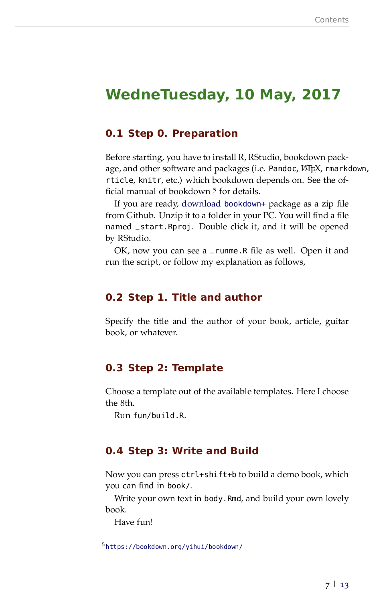
```

You can write a laboratory journal or a personal diary with the 'journal' template (Fig. \@ref(fig:imgjournal)) by simply running:

```{r, eval=FALSE}
bookdownplus(template = 'journal')
```

If you would like to specify the title and author, you can run the following code instead:

```{r, eval=FALSE}
bookdownplus(template = 'journal',
             author = 'John Smith',
             title = 'My journal')
```

In your working directory you could now open 'bookdownplus.Rproj' with RStudio. Press 'ctrl+shift+b' to build it. Your will get a book file named 'journal.pdf' in '_book/' folder as an example. 

Write your own text in 'index.Rmd' and 'body.Rmd', and build your own journal book. You could revise the title and author list in 'index.Rmd'.

You might notice the wide margin of the pages. The margins are for your future use, i.e. adding comments or notes.

The 'journal' template is built on the basis of the LaTeX class 'labbook.cls' by Frank Küster. You could customize 'style/labbook.cls' if you are an expert on LaTeX.

## Poem book {#poem_book}

A poem book produced with 'bookdownplus' looks like Fig. \@ref(fig:imgpoem). You can write such a book with the 'poem' template by simply running:

```{r, eval=FALSE}
bookdownplus(template = 'poem')
```


```{r imgpoem, fig.cap='A poem book', out.width='80%', fig.align='center', echo=FALSE}
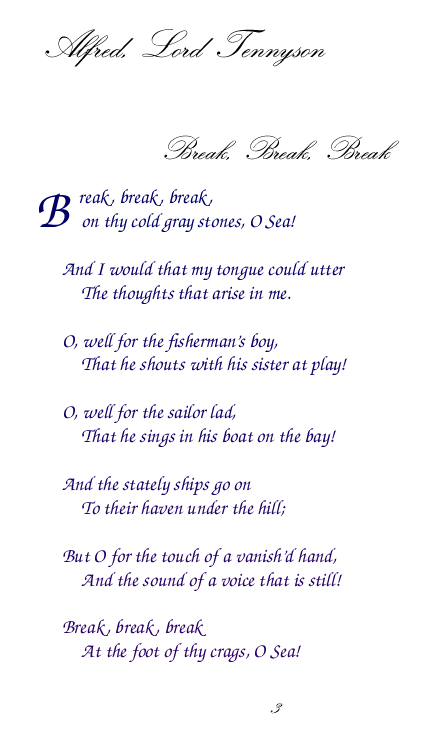
```

If you would like to specify the title and author, you can run the following code instead:

```{r, eval=FALSE}
bookdownplus(template = 'poem',
             author = 'John Smith',
             title = 'My Poem book')
```

In your working directory you could now open 'bookdownplus.Rproj' with RStudio. Press 'ctrl+shift+b' to build it. Your will get a book file named 'poem.pdf' in '_book/' folder as an example.

Write your own text in 'index.Rmd' and 'body.Rmd', and build your own poem book. You could revise the title and author list in 'index.Rmd'.

In 'body.Rmd' you can use the mark `\bb{}` to enlarge the first letter of each paragraph of a poem. \m{Is it called 'paragraph' or somthing else? I am not sure.}

## Music {#music}

Writing books including music pieces is difficult. Think about how to do it in Microsoft Word. Fortunately 'bookdown' works on the top of LaTeX, and there are LaTeX solutions for music books.

You can write a guitar chord book by simply running:

```{r, eval=FALSE}
bookdownplus(template = 'guitar')
```

If you would like to specify the title and author, you can run the following code instead:

```{r, eval=FALSE}
bookdownplus(template = 'guitar',
             author = 'John Smith',
             title = 'My Guitar book')
```

In your working directory you could now open 'bookdownplus.Rproj' with RStudio. Press 'ctrl+shift+b' to build it. Your will get a book file named 'guitar.pdf' in '_book/' folder as an example. The book looks like Fig. \@ref(fig:imgguitar).

```{r imgguitar, fig.cap='A guitar chord book', out.width='80%', fig.align='center', echo=FALSE}

```

Write your own text in 'index.Rmd' and 'body.Rmd', and build your own guitar chord book. You could revise the title and author list in 'index.Rmd'.

Open 'body.Rmd', and you could see how the chords are inserted. For example, the mark `\F` means 'F chord', and the mark `\Am` means 'A minor chord'. These marks are pre-defined by users in 'tex/template_guitar.tex'. I have defined some often-used chords. If you are interested, you can add more chords and share them with me, so that we could build a complete chord library for 'bookdownplus' users. The method to define a new chord can be found in the documentation of 'gchord' ^[http://kasper.phi-sci.com/gchords/], which is a LaTeX package for typesetting guitar chord diagrams by Kasper Peeters.

Writing a guitar chord book ^[https://bookdown.org/baydap/bdguitar/] is the upper limit of my knowledge in music. I would not go further in this direction, but you can do more with 'bookdown' if you want. The 'musixtex' package ^[https://www.ctan.org/pkg/musixtex?lang=en] of LaTeX makes it possible to typesetting music like Fig. \@ref(fig:imgmusixtex). I guess it should not be difficult to tailor it into 'bookdownplus'. Be brave to do it!

```{r imgmusixtex, fig.cap='Typesetting music with musixtex package', out.width='80%', fig.align='center', echo=FALSE}
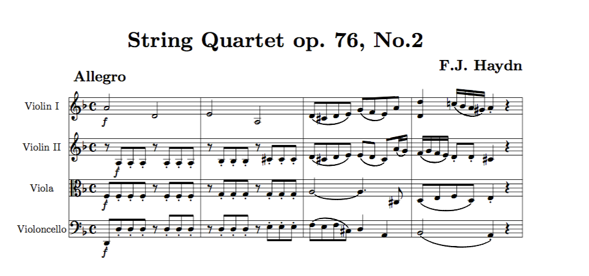
```

# Office {#office}

## Mail {#mail}

The 'mail' template generates a mail like Fig. \@ref(fig:imgmail). There are multiple options in the 'mail' template, with which you can produce different types of letters. These options can be classified into two groups: content and theme.

```{r imgmail, fig.cap='A personal mail', out.width='80%', fig.align='center', echo=FALSE}
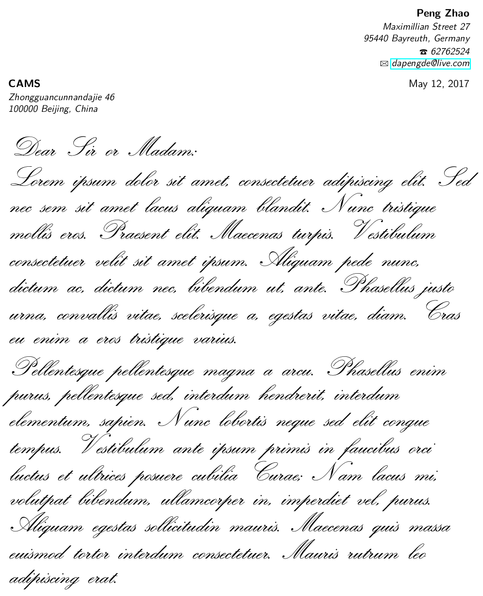
```

### Arguments for mail content

A letter has a unique structure different from other documents. There are sender's and recipient's addresses, their phones and affiliations, and the opening and closing words. These must be specified in the arguments of `bookdownplus()`:

```{r, eval=FALSE}
bookdownplus(author = "Peng Zhao",
             mail_from_address = "15 Robin Hood Lane", 
             mail_from_town = "11758  Massapequa, Long Island, New York", 
             mail_from_phone = "31415926", 
             mail_from_mobile = "31415927", 
             mail_from_fax = "31415928", 
             mail_from_email = "dapengde@live.com", 
             mail_to_who = "recipient", 
             mail_to_affiliation = "University of Innsbruck", 
             mail_to_address = "recipient address", 
             mail_to_town = "100000 Beijing, China", 
             mail_opening = "Dear Sir or Madam,", 
             mail_closing = "Yours faithfully,", 
             mail_date = "25 June, 2017")
```

I believe these arguments are self-explanary.

### Mail themes

You can use several functions to decide how your mail looks.

The function `mail_style()` displays the available layouts of the mail:

```{r}
mail_style()
```

You can use these layouts for the `mail_style` argument in `bookdownplus()`:

```{r, eval=FALSE}
bookdownplus(mail_style = 'banking')
```

The function `mail_theme()` displays the available themes for the sender's header of the letter:

```{r}
mail_theme()
```

They are actually the colors of the sender's name.


As you are writing a mail to print, it would be nice if you think about the receiver's eyesight. You could change the font size of your mail by using the `mail_font()` argument for the fonts of your mail body, `mail_bodysize` argument for the font size of the mail body, and `mail_fontsize()` argument of the entire mail.

```{r, eval=FALSE}
bookdownplus(mail_font = 'calligra',
             mail_fontsize = '12pt', 
             mail_bodysize = 'large')
```

If you are too lazy to memorize their values, you can use the following functions to  remind you:

```{r}
mail_font()
mail_fontsize()
mail_bodysize()
```


## Calendar {#calendar}

Creating a calendar with 'bookdown' is challenging, but possible, if only you accept LaTeX. More or less, the 'calendar' template may help us see how far we can go with 'bookdown'.

A calendar template can be created by running:

```{r, eval=FALSE}
bookdownplus(template = 'calendar')
```

In your working directory you could now open 'bookdownplus.Rproj' with RStudio. Press 'ctrl+shift+b' to build it. Your will get a file named 'calendar.pdf' in '_book/' folder as an example. The calendar looks like Fig. \@ref(fig:imgcalendar).

```{r imgcalendar, fig.cap='A monthly calendar', out.width='100%', fig.align='center', echo=FALSE}
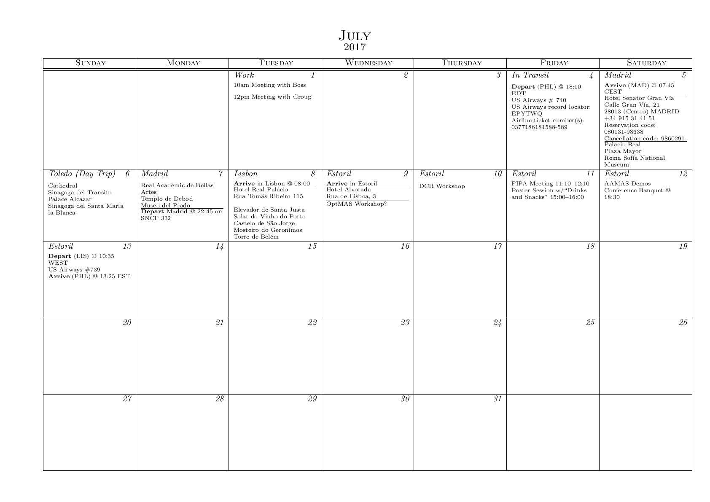
```

The content of the calendar can be revised in 'body.tex'. There are examples and fully explanations in it. I am not that interested in creating calendars, but I will be glad if you let me know how you like it.

# Academic {#academic}

## Articles {#articles}

Writing academic articles with 'bookdown' was my original intention of developing 'bookdownplus'. This chapter comes so late because I don't want this book to scare those non-academic users. Actually, writing academic articles is the most beautiful essence of 'bookdown' from my point of view. Only in an academic article can users utilize the full support of superscripts, subscripts, footnotes, equations, tables, reproducible figures, citations, and cross-references.

An academic article produced with 'bookdownplus' looks like Fig. \@ref(fig:imgarticle). You can write such an article with the 'article' template by simply running:

```{r, eval=FALSE}
bookdownplus(template = 'article')
```

```{r imgarticle, fig.cap='An academic article', out.width='80%', fig.align='center', echo=FALSE}
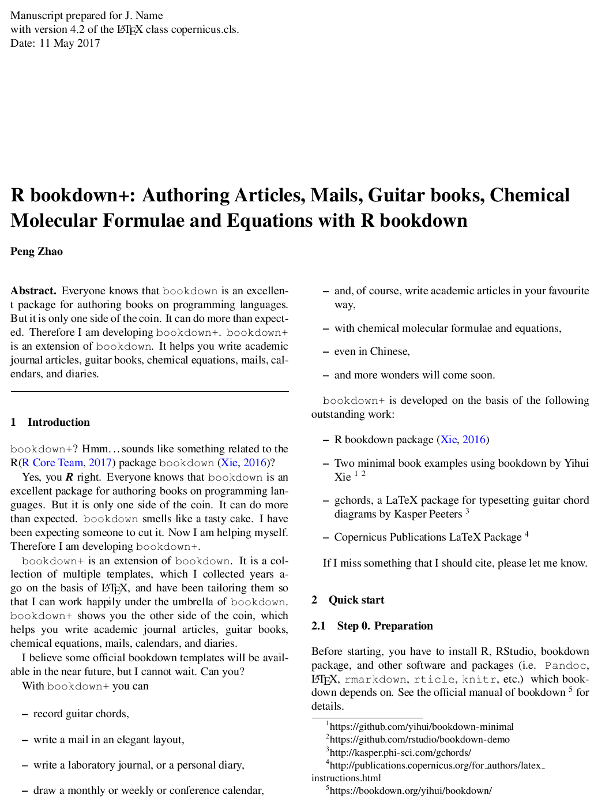
```

If you would like to specify the title and author, you can either run the following code instead:

```{r, eval=FALSE}
bookdownplus(template = 'article',
             author = 'John Smith',
             title = 'My article')
```

or revise it later.

In your working directory you could now open 'bookdownplus.Rproj' with RStudio. Press 'ctrl+shift+b' to build it. Your will get a book file named 'article.pdf' in '_book/' folder as an example.

Write your own text in 'index.Rmd' and 'body.Rmd', and build your own article. You could revise the title and author list in 'index.Rmd'.

By default, the 'article' templates uses the two-columned LaTeX package by Copernicus Publications ^[http://publications.copernicus.org/for_authors/latex_instructions.html]. They provide a template for discussion layrout as well, which was tailored as the 'discussion' template:

```{r, eval=FALSE}
bookdownplus(template = 'discussion')
```

Furthermore, numerous academic journals provide their own LaTeX templates. Although I will add more article templates to 'bookdownplus' \m{quite dependent on my academic career} in the future, it would be appreciated if you join me and share your work.

## Thesis {#thesis}

An academic thesis produced with 'bookdownplus' looks like Fig. \@ref(fig:imgthesisubt). Multiple templates for thesis are available in 'bookdownplus'. You can create such a thesis with the 'thesis_ubt' template by simply running:

```{r, eval=FALSE}
bookdownplus(template = 'thesis_ubt')
```
```{r imgthesisubt, fig.cap='A thesis of University of Bayreuth',  out.width='80%', fig.align='center', echo=FALSE}
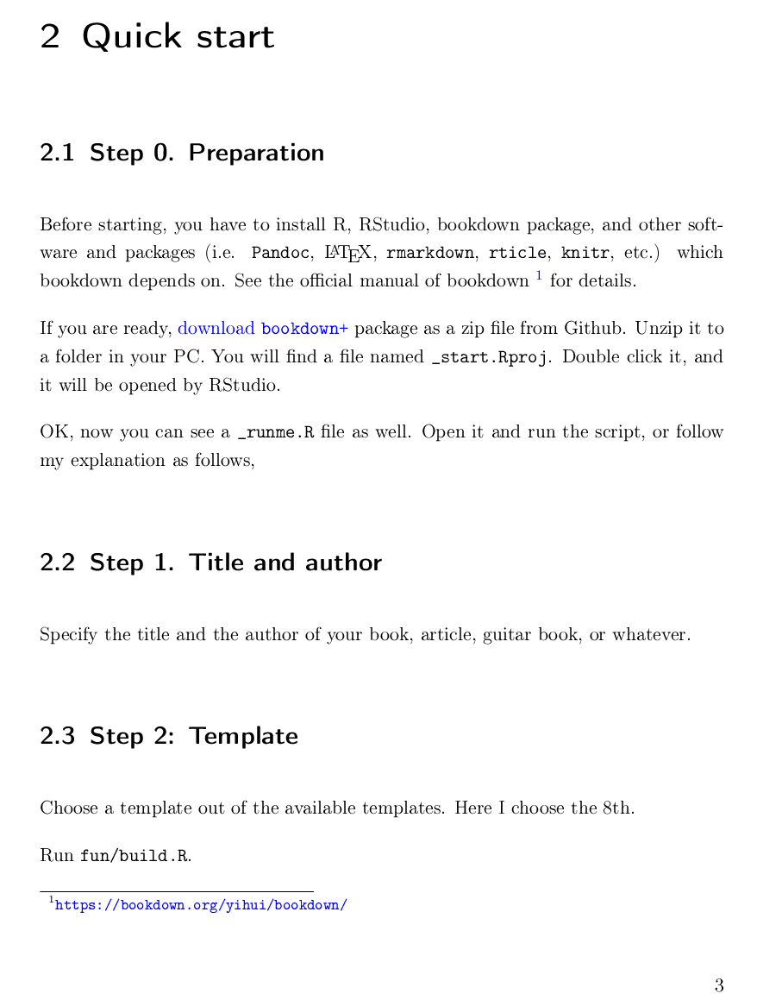
```

In your working directory you could now open 'bookdownplus.Rproj' with RStudio. Press 'ctrl+shift+b' to build it. Your will get a book file named 'thesis_ubt.pdf' in '_book/' folder as an example.

The postfix 'ubt' is the abbreviation of University of Bayreuth (UBT) where I achieved my PhD. The 'thesis_ubt' template is actually originated from the LaTeX file of my PhD dissertation. Thanks to my UBT colleagues who taught me how to use LaTeX. 

To modify the demo thesis into your own, you have to go through more steps than creating single articles due to the complicated structure of a dissertation. Don't worry. Follow me and you can eat it like a piece of cake.

1. The main part of your thesis can be written in 'body.Rmd' and 'index.Rmd' in the same way as other templates. Congratulations! You have done 90% of the work.

2. Open 'tex/template_thesis_ubt.tex' with a text editor (e.g. 'NotePad++'). Now you see scary LaTeX codes in it. Be brave. You will conquer them.

3. In Line 68 -- 82 you can specify your own subject, institute, supervisor's name, etc.

4. In Line 94 -- 119 you can modify them into the symbols and abbreviations of your own. If you don't need them, just remove these lines.

5. In Line 122 -- 136 you can remove the chapters you don't need, but leave `$body$` untouched. `$body$` is the location where the content of 'body.Rmd' will be inserted. 

Now it is done.

The dissertation of UBT requires some chapters written in German, which you can see in 'tex/template_thesis_ubt.tex'. I leave them there for the convenience of those users studying in German speaking regions. If you don't need them, just simply remove them as you like.

Besides 'thesis_ubt', a simple template called 'thesis_mypku' can be performed for those written in Chinese:

```{r, eval=FALSE}
bookdownplus(template = 'thesis_mypku')
```

This template was modified from 'yihui_zh' template with some pages from my master thesis in Peking University (PKU). Be careful, though, if you use this template to write your PKU thesis. There have been official requrements for the thesis format recently, which is different from my thesis written more than a decade ago. 

Other templates for academic thesis are 'thesis_classic' and 'thesis_zju'. The pdf version of this book you are reading now is created with 'thesis_classic' by Andre Miede ^[http://www.ctan.org/tex-archive/macros/latex/contrib/classicthesis/]. You can see how it works in the source code of this book ^[https://github.com/pzhaonet/bookdown-plus-textbook]. For example, you could add a `subtitle` field in the YAML header of 'index.Rmd', then the subtitle apprears on the cover page of the book.

The 'thesis_zju' template is modified from the LaTeX template of thesis of Zhejiang Uni., which will be described in Chapter \@ref(thesis).

Numerous universities and institutes provide their own LaTeX templates for thesis. Although I will add more thesis templates to 'bookdownplus' in the future, it would be appreciated if you join me and share your work.

## Poster {#poster}

I did not expect to create academic posters with R 'bookdown' or 'markdown', because I think posters are not necessarily as structured as articles. Microsoft Powerpoint is still the easiest way to make a poster. A poster created in markdown syntax has its own advantages, though. It is reproducible, easy to maintain, easy to change the style, and has the common features of R markdown. You could see the posters generated by 'bookdownplus' in Fig. \@ref(fig:imgposter). Not bad, hmmm?

```{r imgposter, fig.cap='Themes of the poster template: eco, ocean, and rose ', out.width='80%', fig.align='center', echo=FALSE}
knitr::include_graphics("images/poster.jpg")
```

The procedure of creating a poster template is different from other 'bookdownplus' templates. Firstly, you have to prepare the software environment. Windows users can do the following steps: 

- Install [Python 2](https://www.python.org/downloads/windows/).

- Install [Python filter support for Pandoc](https://pypi.python.org/pypi/pandocfilters):
on a Windows command prompt, type `pip install pandocfilters`

- Install [SumatraPDF](http://www.sumatrapdfreader.org/download-free-pdf-viewer.html) for auto-refresh of PDF previews

- Add the Python directory to the system PATH variable (Computer -- right click -- Properties -- Advanced System Settings -- Environmental Variables -- PATH -- Edit).

Linux users can refer to the instruction of kuleuven-templates ^[https://github.com/exporl/kuleuven-templates], which is the origin of the 'poster' template.

Now you can create such a poster with the 'poster' template by running:

```{r, eval=FALSE}
bookdownplus(template = 'poster',
             theme = 'eco',
             email = 'youremail@email',
             institute = 'your institute',
             web = 'http://youdomain.com',
             logo = 'your logo picture',
             backimg = 'your background image',
             bibliofiles = 'your bib file')
```

In 'bookdownplus()', only `template` and `theme` have to be specified. Other arguments are optional, which can be modified later.

Three themes for posters are available in 'bookdownplus 1.0.2': 'eco' (default), 'ocean', and 'rose'. Of course you can create your own theme on the basis of 'tex/poster_eco.tex' if you are a LaTeX expert \m{It would be appreciated if you could share your templates with me}. 

In your working directory you could now open 'index.Rmd' with RStudio. Click the 'Knit' button in the toolbar of the top-left panel, and you will get a file named 'index.pdf' in your working directory as a demo. However, the Bibliography section in the poster is empty. Click the 'Knit' button once again and it will be filled. If you know how bibtex works, it will be easy to understand why you have to knit twice. But just do it and never be bothered.

As you know the steps of creating a demo poster, now it is time to build your own poster. I would recommend you to read the demo 'index.Rmd' from A to Z, then you will get all the ideas of the key elements in a markdown poster. Besides the common bookdown syntax, the following is a list of specific ones for the poster:

- Use `[columns=2]` to make a new row split into 2 columns and `[/columns]` to end the row. Use `[column]` to start a new column in the row. 

- Use `\vskip0.5cm` to adjust the verticle blank space in a column.

- Use `\printbibliography` to create the Bibliography section.

Have you noticed something? The hot key or button of building a 'bookdown' document has never been used for the 'poster' template! Indeed 'bookdownplus' poster template is nothing to do with 'bookdown'. It is a 'markdown' solution for posters extracted from kuleuven-templates ^[https://github.com/exporl/kuleuven-templates] with my additional contribution. I put it in the 'bookdownplus' package only because poster is a piece of the puzzle in academic productions, and I would like to build 'bookdownplus' as a complete academic tool.

In the meanwhile I am developing a stand-alone version of the poster template as the 'postr' package [@R-postr] for non 'bookdown' users. This stand-alone version is more advanced and up-to-date with some more themes and features. For instance, it has a function for removing unnecessary files and folders bi-produced by the poster template. 

## Chemistry {#chemistry}

A chemistry article or book produced with 'bookdownplus' looks like Fig. \@ref(fig:imgchemistry). You can write such a book with the 'chemistry' template by simply running:

```{r, eval=FALSE}
bookdownplus(template = 'chemistry')
```

```{r imgchemistry, fig.cap='A chemistry book', out.width='80%', fig.align='center', echo=FALSE}
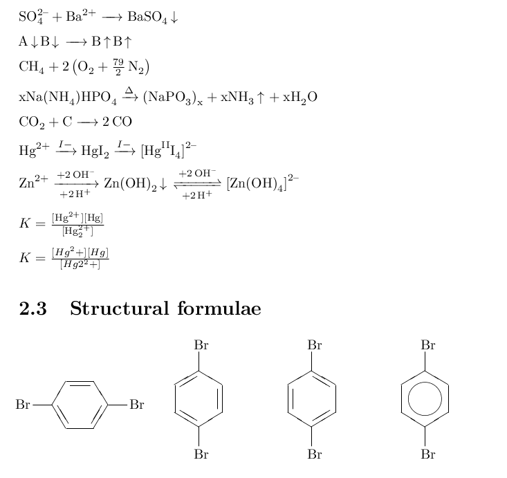
```

In your working directory you could now open 'bookdownplus.Rproj' with RStudio. Press 'ctrl+shift+b' to build it. Your will get a book file named 'chemistry.pdf' in '_book/' folder as an example.

Write your own text in 'index.Rmd' and 'body.Rmd', and build your own poem book. You could revise the title and author list in 'index.Rmd'.

In 'body.Rmd' you can see how to insert chemical formulae, chemical equations, and structural formulae. For more details, please see the 'mhchem' LaTeX package by Martin Hensel ^[https://www.ctan.org/pkg/mhchem].

# Advanced {#advanced}

## Chinese {#chinese}

The support for Chinese typesetting with 'bookdown' is tricky. Briefly speaking, you need a LaTeX template which supports Chinese characters and styles. In Chapter \@ref(simple) the template 'yihui_zh' was introduced. It is a nice template for daily use. However, you might encounter some problems when producing html files from the chapter headers which contains Chinese characters, especially those mixes with Latin letters. See the discussion between me and Yihui ^[https://disqus.com/home/discussion/yihui/_yihui_xie_679/#comment-3175332429]. One solution is to add `{#identifier}` manually to those problematic headers. I tried this. It was boring because I finished a book first and added the #IDs later. Another solution is using the 'pinyin' package [@R-pinyin]. A function called `bookdown2py()` can convert the headers into pinyin (the official romanization system for Standard Chinese^[https://en.wikipedia.org/wiki/Pinyin]) and add the #IDs automatically:

```{r, eval=FALSE}
install.packages('pinyin')
library('pinyin')
?bookdown2py
```

More details about the 'pinyin' package can be found on my GitHub repo^[https://github.com/pzhaonet/pinyin].

'bookdownplus' gives your more options to create other documents in Chinese. For example, the 'nte_zh' template is designed for writing novels or proses which are not as structured as academic thesis:

```{r, eval=FALSE}
bookdownplus(template = `nte_zh`)
```

The template name 'nte' is short for 'Nothing to Envy', the title of the book whose LaTeX code was the origin of this template. I have written a book with the 'nte_zh' template, which is online^[https://bookdown.org/baydap/papasdiary/].

If you are writing an academic article in Chinese, you can use the 'article_zh' template:

```{r, eval=FALSE}
bookdownplus(template = 'article_zh')
```

In your working directory you could now open 'bookdownplus.Rproj' with RStudio. Press 'ctrl+shift+b' to build it, and you will get a file named 'article_zh.pdf' in '_book/' folder as an example (Fig. \@ref(fig:imgarticlezh)). 

```{r imgarticlezh, fig.cap='An academic article in Chinese', out.width='80%', fig.align='center', echo=FALSE}
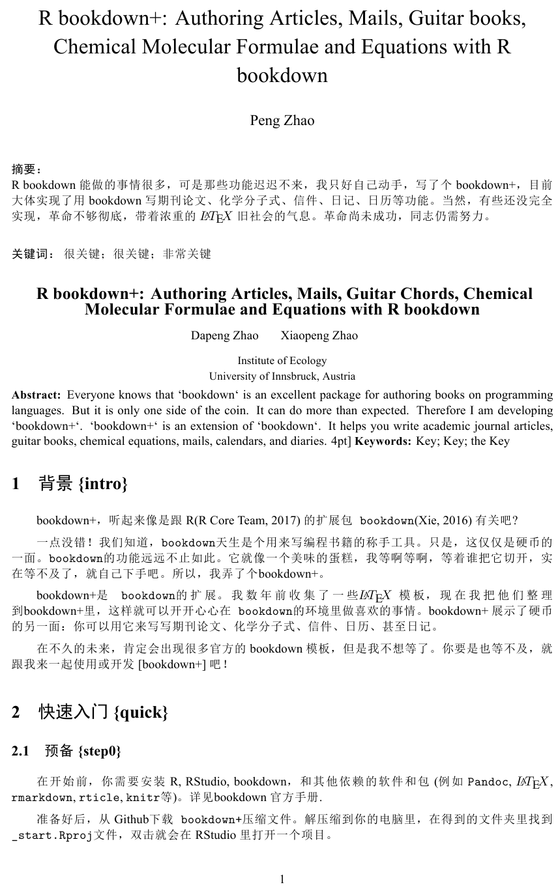
```

Similar to other templates, you can write your own text in 'index.Rmd' and 'body.Rmd'. You could revise the title and author list in 'index.Rmd'.

The particular section of this demo file is the abstract. It is bilingual with different formats from the main body. You can revise your abstract in 'abstract.tex'. It is self-explanatory, although written in LaTeX. I wish I could tailor it into markdown, but I don't think it is necessary. 

If 'yihui_zh' template does fulfil your request for academic thesis in Chinese, you could use the 'theis_zju' template:

```{r, eval=FALSE}
bookdownplus(template = 'thesis_zju')
```

In your working directory you could now open 'bookdownplus.Rproj' with RStudio. Press 'ctrl+shift+b' to build it, and you will get a file named 'thesis_zju.pdf' in '_book/' folder as an example (Fig. \@ref(fig:imgthesiszju)). 


```{r imgthesiszju, fig.cap="A thesis generated from zju template", out.width='80%', fig.align='center', echo=FALSE}
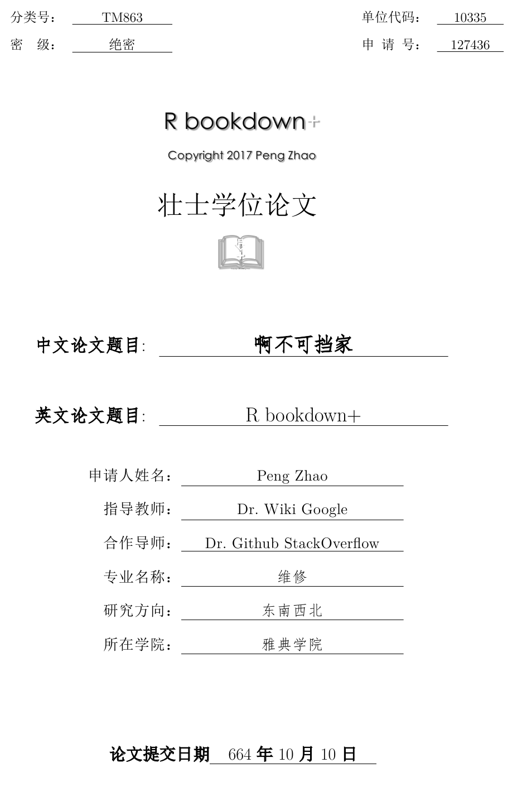
```

Now you can write your own text in 'index.Rmd' and 'body.Rmd'. There are much more fields in 'index.Rmd' for you owing to the complicated structure of the thesis. Be patient. It is only the beginning of a dissertation.

The postfix 'zju' is short for Zhejiang University, one of the top universities in China. I have never been there. I tailored it into 'bookdownplus' only because I found a LaTeX template of ZJU thesis and compiled it successfully. There are templates available for the thesis of other universities and institutes, such as Peking University ^[https://github.com/CasperVector/pkuthss] and Tsinghua University ^[https://github.com/xueruini/thuthesis]. Unfortunately I failed in compiling these LaTeX templates on my computer. I am not a LaTeX expert. I wish these templates could perhaps be tailored and included in 'bookdownplus' in the future, if you can help and join me.

A combination of multiple templates could generate a new one, such as the 'chemistry_zh' template:

```{r, eval=FALSE}
bookdownplus(template = 'chemistry_zh')
```
Open 'bookdownplus.Rproj' and press 'ctrl+shift+b' to build it, and you will get a file named 'chemistry_zh.pdf' in '_book/' folder. Now you can write a chemistry book in Chinese. This template is the child parented by 'yihui_zh' and 'chemistry' templates. In this way you could customize your own template. A further description of creating your own templates is in Chapter \@ref(customize).

## Mind Map {#mind_map}

Now you have your books or thesis done. It would be nice to show the outline of your book in a mind map. The mind map of this book is shown in Fig. \@ref(fig:imgmindmap).

```{r imgmindmap, fig.cap='Mind map of R bookdownplus Textbook', out.width='80%', fig.align='center', echo=FALSE}
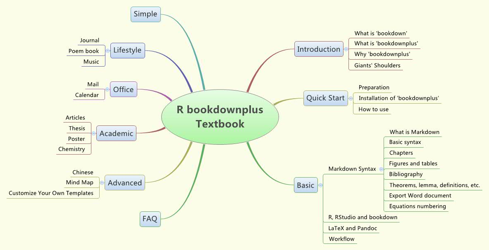
```

Owing to the advantage of 'bookdown', you don't have to draw such a mind map by hand. This mind map is automatically generated from the 'body.Rmd' file of the 'R bookdownplus Textbook' by using the R package 'mindr' ^[@R-mindr]:

```{r, eval=FALSE}
install.packages('mindr')
library('mindr')
?md2mm()
```

With the 'mindr' package you can easily extract the outline from your 'bookdown' file. More details about the 'mindr' package can be found on my GitHub repo^[https://github.com/pzhaonet/mindr].

## Create Your Own Templates {#customize}

`bookdownplus` provides you around 20 templates and more will be included in the future. If you study these avaible templates carefully and read Chapter 4 of the official manual of 'bookdown'^[https://bookdown.org/yihui/bookdown/], you will get the idea of how to create your own templates. 

Here is some hints from my experience:

- 

-

- 


# FAQ {#faq}

# Bibliography {-}
